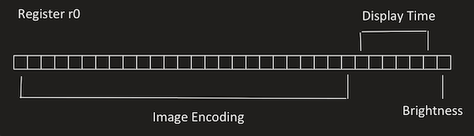

# Design Document

## Overview

My LEDs light show tells a story of a loving couple. It starts with a twinkling heart hit by a flying Jupiter Arrow. Then, two people show up at the opposite corner and walk together. The next scene shows some meteors and stars randomly appearing on the screen. The light show ends with all the LEDs lighting up in a spiral sequence, implying that they are married. Many techniques have been used to achieve this light show, including the line-by-line display of an image, change in LEDs' brightness by pulse width modulation, and generation of real and pseudo random numbers.

## Implementation

Every frame or image in the show is encoded by a 32-bit binary number in r0 (Figure 1). The first lowest bit tells the brightness. The second to seventh lowest bits decide how long an image lasts. The rest of the 25 bits correspond to the 25 LEDs on Microbit, which describes how an image looks. The function `display` is used to convert encodings to images. It first extracts the brightness and time bits and stores them into r4 and r5, respectively. Then, it splits the rest of the 25 bits into five parts, and each part corresponds to a row of LEDs. Since every LED cannot be controlled individually, the function only lets one row of LEDs light up at a time, and each row is on and off sequentially and quickly. Whenever all rows have lit up once, a display loop has pasted. The display time stored in r5 essentially described the number of display loops. To control a row of LEDs, the function `display_row` can help. This function accepts a 5-bit row encoding and row number and translates them into the addresses and bit indexes of DIR or OUT registers. After that, it passes these values to its helper functions `set_col`, `set_row`, `clear_all_col`, `clear_row`, `row_on`, and `row_off` to change the corresponding pins. The function `delay` within `display_row` adjusts the time proportion between the on and off of a row of LEDs. The higher the proportion of time the LEDs are on, the brighter the image appears to be. Therefore, the brightness information stored in r4 eventually controls the `delay` function. After all 32 bits are read, an image is then shown on Microbit. 

Figure 1: Image Encoding

## Analysis

The use of image encoding has been the most helpful decision throughout the project. It enables me to efficiently design my light show patterns without worrying about low-level LED instructions. It also increases the extensibility of the program, which allows it to show various light shows with different sequences of encodings. When making animations such as moving mentors and spirals, I realised the encodings between two adjacent frames are very similar. Therefore, instead of explicitly saving all frames, I only saved the operations that can generate the next frame based on the previous frames, which may reduce the size of my program and possibly decrypt my images. However, the translation from encodings to operations also increases the time of programming. When making 3 LEDs light up randomly and together as stars, I noticed that the Microbit RNG peripheral is not able to generate three random numbers instantly. Therefore, I chose Linear Congruential Generator to produce pseudo-random numbers, with a real random number as the seed. This makes the generation of random a lot faster. The randomness is enough for making light shows but may not be reliable in statistics. The light show may introduce the sound feature as a further improvement because most light shows in the real world have background music. However, the way to make sound and animation play concurrently is still a challenging part.

